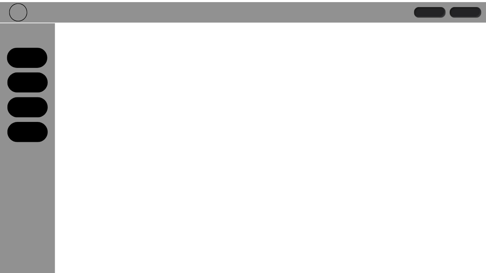
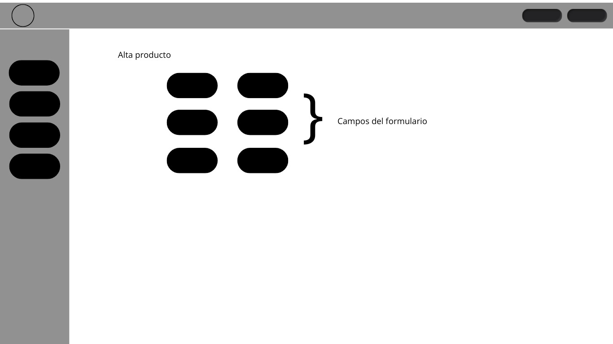
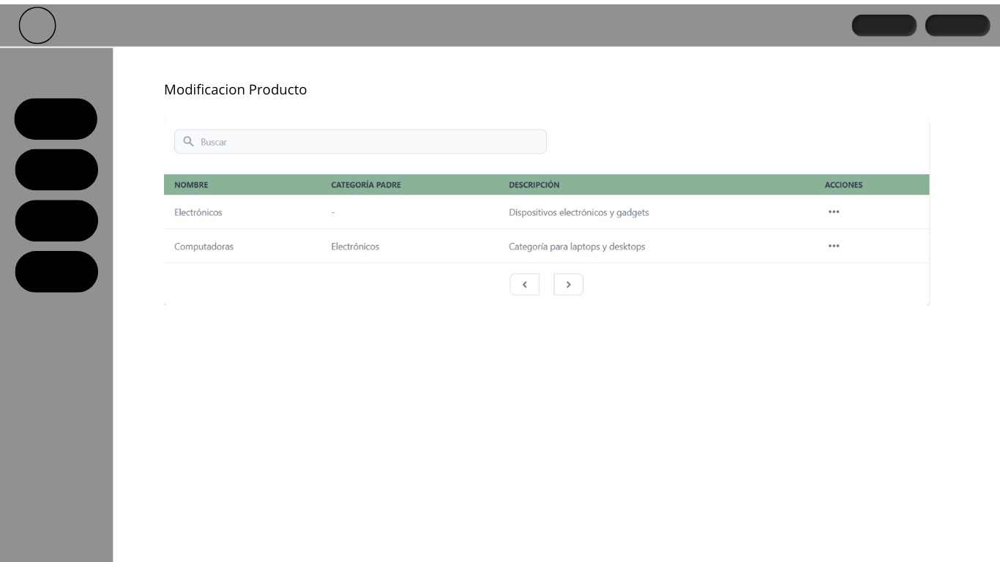
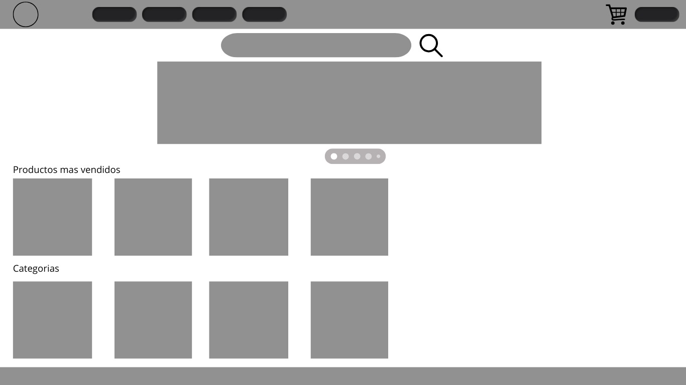
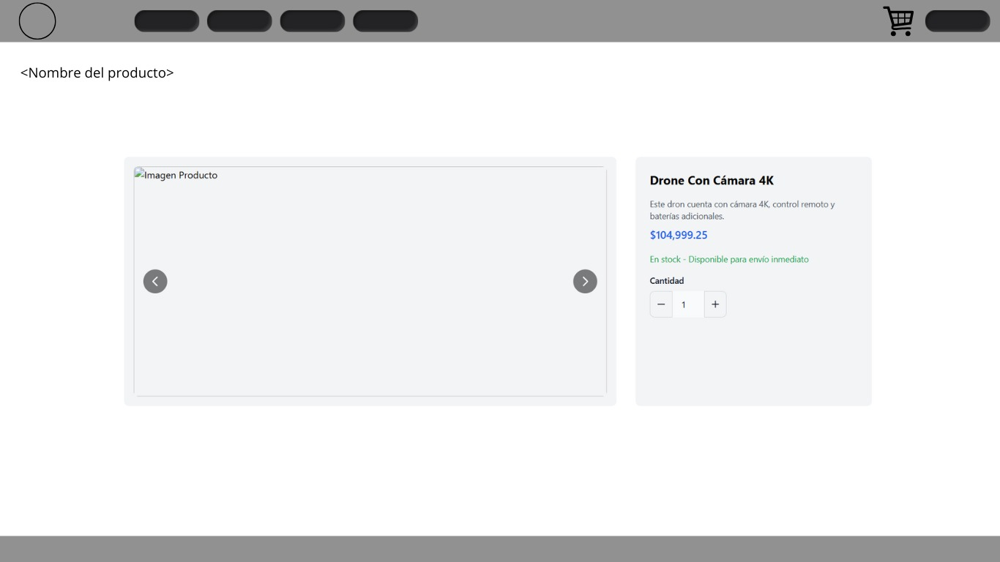

# Trabajo en equipo

- Franco : Creacion de estructura del proyecto y puesta en funcionamiento
- Carlos : Descripcion de requisitos funcionales e historias de usuario
- Camila : Creacion de modelos e implementancion de codigo fuente
- Camila : Creacion de diagrama de clases
- Luis : Creacion de Wireframes e interfaces de pantalla
- Exequiel : Creacion y asignacion de tareas. Descripcion de documentos dp-iteracion y roadmap

---

# Diseño OO

[Ver diagrama de clase](https://app.diagrams.net/#G1dhtH5_mKPAMMXkK95dOQLLSukZ_KvHiq#%7B%22pageId%22%3A%228-AYVthF0uPXiU_x2BDl%22%7D)

---

# Wireframe y caso de uso

<<un boceto simple (o algunos) de cómo se verá la interfaz
de usuario, acompañado de casos de uso para describir cómo interactúa el usuario
con la aplicación.>>

## Vista desde administración
Panel de administración

Alta de producto

Listado de productos

## Vista de cliente
Tienda

Detalle de producto | tienda

---

# Backlog de iteraciones

> **Id: HU01**
>
> - **Título:** Gestión de Productos
> - **Prioridad:** Alta
> - **Tiempo estimado:** 8 horas (sujeto a modificaciones)
> - **Historia de usuario:** Como administrador de la tienda, quiero agregar, actualizar o eliminar productos en el inventario, para mantener la información de los productos actualizada y precisa.

> **Id: HU02**
>
> - **Título:** Compra de Productos Individuales
> - **Prioridad:** Alta
> - **Tiempo estimado:** 5 horas (sujeto a modificaciones)
> - **Historia de usuario:** Como cliente, quiero poder ver los detalles de un producto ecológico individual (nombre, descripción, precio, disponibilidad), para decidir si deseo comprarlo.

> **Id: HU05**
>
> - **Título:** Selección de Medio de Pago
> - **Prioridad:** Alta
> - **Tiempo estimado:** 6 horas (sujeto a modificaciones)
> - **Historia de usuario:** Como cliente, quiero poder elegir entre múltiples métodos de pago (tarjeta de crédito, transferencia bancaria, etc.), para completar mi compra de forma segura y rápida.

> **Id: HU06**
>
> - **Título:** Confirmación de Pedido
> - **Prioridad:** Media
> - **Tiempo estimado:** 3 horas (sujeto a modificaciones)
> - **Historia de usuario:** Como cliente, quiero recibir una confirmación del pedido por correo electrónico después de realizar mi compra, para contar con un comprobante de la transacción.

> **Id: HU07**
>
> - **Título:** Gestión de Inventario Automático
> - **Prioridad:** Alta
> - **Tiempo estimado:** 4 horas (sujeto a modificaciones)
> - **Historia de usuario:** Como administrador u operador de la tienda, quiero que el inventario se actualice automáticamente después de cada venta, para mantener un registro preciso de los productos disponibles.

---

# Tareas

- Crear interfaz grafica de la tienda online.
- Gestionar productos.
- Gestionar la compra de productos individuales.
- Gestionar el pago del carro de compras.
- Notificar al cliente el pago de los productos.
