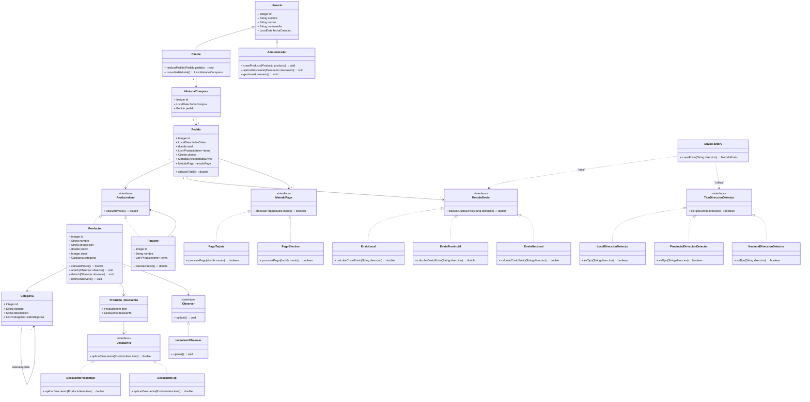

```mermaid
classDiagram
    class Usuario {
        + Integer id
        + String nombre
        + String correo
        + String contraseña
        + LocalDate fechaCreacion
    }

    class Cliente {
        + realizarPedido(Pedido pedido): void
        + consultarHistorial(): List~HistorialCompras~
    }

    class Administrador {
        + crearProducto(Producto producto): void
        + aplicarDescuento(Descuento descuento): void
        + gestionarInventario(): void
    }

    class ProductoItem {
        <<interface>>
        + calcularPrecio(): double
    }

    class Producto {
        + Integer id
        + String nombre
        + String descripcion
        + double precio
        + Integer stock
        + Categoria categoria
        + calcularPrecio(): double
        + attach(Observer observer): void
        + detach(Observer observer): void
        + notifyObservers(): void
    }

    class Paquete {
        + Integer id
        + String nombre
        + List~ProductoItem~ items
        + calcularPrecio(): double
    }

    class Categoria {
        + Integer id
        + String nombre
        + String descripcion
        + List~Categoria~ subcategorias
    }

    class Descuento {
        <<interface>>
        + aplicarDescuento(ProductoItem item): double
    }

    class DescuentoPorcentaje {
        + aplicarDescuento(ProductoItem item): double
    }

    class DescuentoFijo {
        + aplicarDescuento(ProductoItem item): double
    }

    class Producto_Descuento {
        + ProductoItem item
        + Descuento descuento
    }

    class Pedido {
        + Integer id
        + LocalDate fechaOrden
        + double total
        + List~ProductoItem~ items
        + Cliente cliente
        + MetodoEnvio metodoEnvio
        + MetodoPago metodoPago
        + calcularTotal(): double
    }

    class MetodoPago {
        <<interface>>
        + procesarPago(double monto): boolean
    }

    class PagoTarjeta {
        + procesarPago(double monto): boolean
    }

    class PagoEfectivo {
        + procesarPago(double monto): boolean
    }

    class MetodoEnvio {
        <<interface>>
        + calcularCostoEnvio(String direccion): double
    }

    class EnvioFactory {
        + crearEnvio(String direccion): MetodoEnvio
    }

    class TipoDireccionDetector {
        <<interface>>
        + esTipo(String direccion): boolean
    }

    class LocalDireccionDetector {
        + esTipo(String direccion): boolean
    }

    class ProvincialDireccionDetector {
        + esTipo(String direccion): boolean
    }

    class NacionalDireccionDetector {
        + esTipo(String direccion): boolean
    }

    class EnvioLocal {
        + calcularCostoEnvio(String direccion): double
    }

    class EnvioProvincial {
        + calcularCostoEnvio(String direccion): double
    }

    class EnvioNacional {
        + calcularCostoEnvio(String direccion): double
    }

    class HistorialCompras {
        + Integer id
        + LocalDate fechaCompra
        + Pedido pedido
    }

    class Observer {
        <<interface>>
        + update(): void
    }

    class InventarioObserver {
        + update(): void
    }

    Usuario <|-- Cliente
    Usuario <|-- Administrador
    ProductoItem <|.. Producto
    ProductoItem <|.. Paquete
    Paquete "1" --> "*" ProductoItem
    Pedido "1" --> "*" ProductoItem
    Pedido "1" --> "1" MetodoEnvio
    Pedido "1" --> "1" MetodoPago
    Producto "*" --> "1" Categoria
    Categoria "1" --> "*" Categoria : subcategorias
    Producto "*" --> "*" Producto_Descuento
    Producto_Descuento "1" --> "1" Descuento
    Descuento <|.. DescuentoPorcentaje
    Descuento <|.. DescuentoFijo
    EnvioFactory ..> MetodoEnvio : "crea"
    EnvioFactory ..> TipoDireccionDetector : "utiliza"
    TipoDireccionDetector <|.. LocalDireccionDetector
    TipoDireccionDetector <|.. ProvincialDireccionDetector
    TipoDireccionDetector <|.. NacionalDireccionDetector
    MetodoEnvio <|.. EnvioLocal
    MetodoEnvio <|.. EnvioProvincial
    MetodoEnvio <|.. EnvioNacional
    MetodoPago <|.. PagoTarjeta
    MetodoPago <|.. PagoEfectivo
    Producto "1" --> "*" Observer
    Observer <|.. InventarioObserver
    Cliente "1" --> "*" HistorialCompras
    HistorialCompras "1" --> "1" Pedido


```